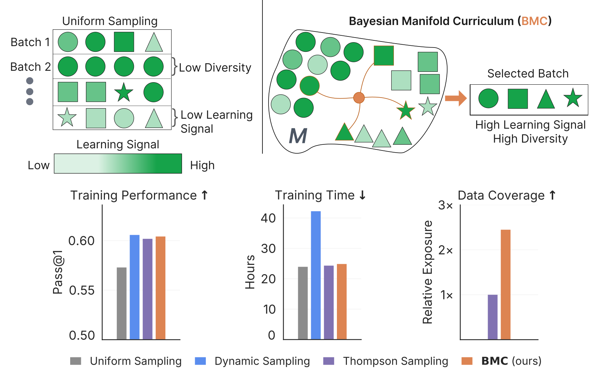

<h1 align="center">
  Manifold Bandits:<br> Bayesian Curriculum Learning over the Latent<br>Geometry of Large Language Models
</h1>

<p align="center">
  <a href="https://arxiv.org/abs/2606.19750">
    
  </a>
  <a href="https://darrienmckenzie.com/manifold-bandits/">
    
  </a>
  <a href="https://github.com/DarrienMcKenzie/manifold-bandits/releases/tag/v0.1">
    
  </a>
  <a href="https://wandb.ai/ucsd-wang-lab-lm/manifold-bandits/reports/Manifold-Bandits-Training-Runs--VmlldzoxNzI4ODc3Mw?accessToken=o98c1xwc8bu5pmruz3d9fgglib13ofgi8o0l8ded90otmxh1mtbf5pqu8ulzuxet">
  
  </a>
</p>

<p align="center">
  
</p>

## Overview

This repository contains the official implementation for **Manifold Bandits: Bayesian Curriculum Learning over the Latent Geometry of Large Language Models**.

The paper introduces two main components:

- **Latent Task Trees**, which hierarchically organize problems according to the latent geometry of an LLM's representation space.
- **Bayesian Manifold Curriculum (BMC)**, a structure-aware curriculum learning framework for sampling problems during RL-based LLM training.

For the full motivation, method, experiments, and visualizations, please see the paper and project page.


## Getting Started

This repository was primarily developed and tested on RunPod. The following RunPod/PyTorch image has worked for our experiments:

```
runpod/pytorch:1.0.2-cu1281-torch280-ubuntu2404
```

Other CUDA/PyTorch environments may also work, but the setup script has been tested with the image above.

After launching a pod with the image above and entering the cloned repository, set up the development environment with:

```bash
bash setup.sh
```

Then activate the environment:

```bash
source mb_env/bin/activate
```

From here, there are two main workflows:

1. **Tree Construction**: build Latent Task Trees for new or existing datasets.
2. **BMC Experiments**: run the main Bayesian Manifold Curriculum experiments.

## Tree Construction

Latent Task Trees organize problems according to the latent geometry of an LLM's representation space. It can be applied across different domains, languages, modalities, and model sizes/classes. This workflow is useful if you want to build trees for your own datasets or models.

We recommend looking at and using the `experiments/mb_treebuild.sh` file, which is formatted for your convenience to build trees. In this file, you will, at bare minimum, need to provide the model path and a file path to a (properly formatted) file containing the prompts/data.

Once that is configured, simply run the following:

```bash
bash experiments/mb_treebuild.sh
```
By default, the resulting word clouds and prompts-per-cluster information are provided in the `analysis` folder, which will be created after execution. The word clouds will be provided in this folder, and the prompts-per-cluster information will be stored in `latent_wc_data.txt`


## Running BMC Experiments

Bayesian Manifold Curriculum (BMC) uses a Latent Task Tree to guide problem sampling during RL-based LLM training. In the paper, though we explore different training configurations, we consider the "main configuration" to be following:
* **Dataset**: DAPO-Math-17k
* **Model**: Qwen3-8B-Base
* **RL Algorithm**: GSPO

Below, we provide the steps needed to run this main configuration.

First, we recommend you login to HuggingFace, since some datasets (like GPQA-Diamond) require authentication.

```bash
hf auth login --token XXX
```

Once logged in, prepare the training set (DAPO-MATH-17k) and the evaluation set using the following:

```bash
bash data_prep/prepare_math.sh
```

Then run the following script, which serves as the primary BMC experiment file:
```bash
bash experiments/mb_gspo_bmc_dapo-math.sh
```
Running this will generate a tree before starting the actual RL training run.

The main experiment file assumes use of a node of 8xH100s by default. Depending on your computational setup, certain hyperparameters may need to be adjusted (batch size, cpu cores, nodes, etc).

 The `experiments` folder also contains other examples, such as training using GRPO instead of GSPO, training on the medical dataset (AlphaMed-19k), running BMC-T instead of BMC, etc.


## Points of Interest

This section highlights the main files and directories to inspect when navigating the codebase. The main files you should be aware of are:
* `main_bmc.py`
  * Houses the **BanditSampler** class
* `bmc_ray_trainer.py`
  * Uses rollout observations during RL training to update **BanditSampler**

### Tree Construction
There's two parts to tree construction:
1) The latent loading phase, which utilizes the `LatentExtractorWorker` and `extract_latents_distributed()` defined in `main_bmc.py`
2) The recursive tree construction phase (PCA, UMAP, Chart Test, and HDBSCAN) is implemented by `create_tree()` in `main_bmc.py` as part of the **BanditSampler** class.

### BMC Sampling
From the paper, there's three parts to BMC:
1) **Top-down problem selection (Hierarchical Thompson Sampling)**, which is performed by the BanditSampler's `sample_batch()` function in `main_bmc.py`
2) **Non-stationary belief modeling (prompt-level belief updates via Bayesian Filtering)**, which is performed in `bmc_ray_trainer.py`
3) **Bottom-up tree update (Empirical Bayes)**, which is performed by `update_tree()` and `subtree_update()` in `main_bmc.py`

### BMC-T
BMC-T, as you'd expect, inherits much of BMC. The two main parts to be aware of are:
1) **Target Setting**: takes in a *target file* (same format as train and test file) that contains prompts, and constructs a tree using the concatenation between the train and target files; see ``run_bmc()`` in `main_bmc.py`
    * These prompts will not be used for training; only used to compute utility bonuses for training problems
    * The *target file* can be anything: the evaluations / test file, a subset of the evaluations, a different dataset entirely, etc
2) **Utility Computation**: utility is precomputed before training begins using overlap between train and target data
    * See combination of functions: `set_node_utility()`,`compute_subtree_counts()` ,`precompute_local_utilities()` in `main_bmc.py`
3) **Train-Test Separation Validation**: curious to see if we accidently trained on the test data directly? See the code surrounding the `#BMC-T-VAL-1` and `#BMC-T-VAL-2` comments in `main_bmc.py`


## Questions and Issues

If you have questions or run into setup issues, feel free to open an issue. You can also contact [d1mckenzie@ucsd.edu](mailto:d1mckenzie@ucsd.edu).

## Diversity Metrics / Tree Diagnostics

The diversity metrics reported in the paper (**rarity-weighted coverage** and **structure gain**), are not calculated or stored in W&B.

These metrics were computed in a separate post-processing pipeline. The analysis scripts and visitation data will be provided in a future update.


## Citation

```bixtex
Coming soon.
```


## License

The code in this repository is released under the MIT License.

The paper and associated written/visual materials are released under CC-BY-4.0 unless otherwise noted.